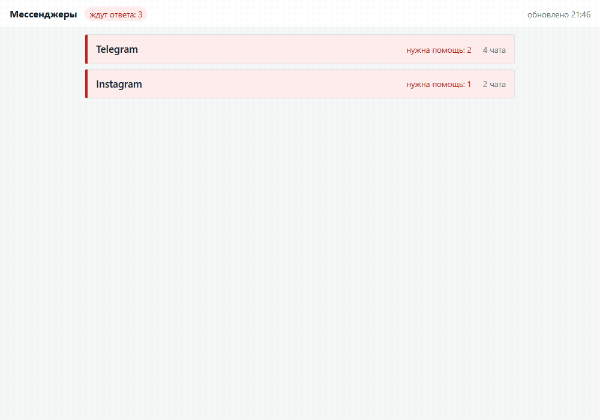
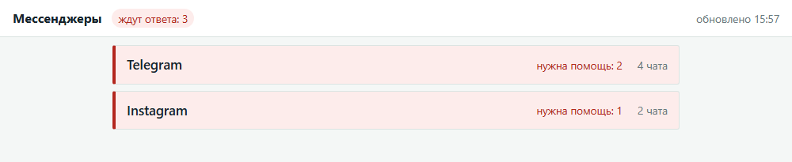
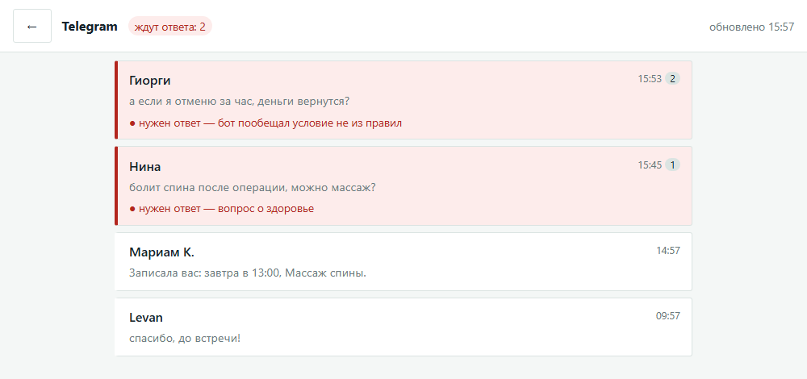
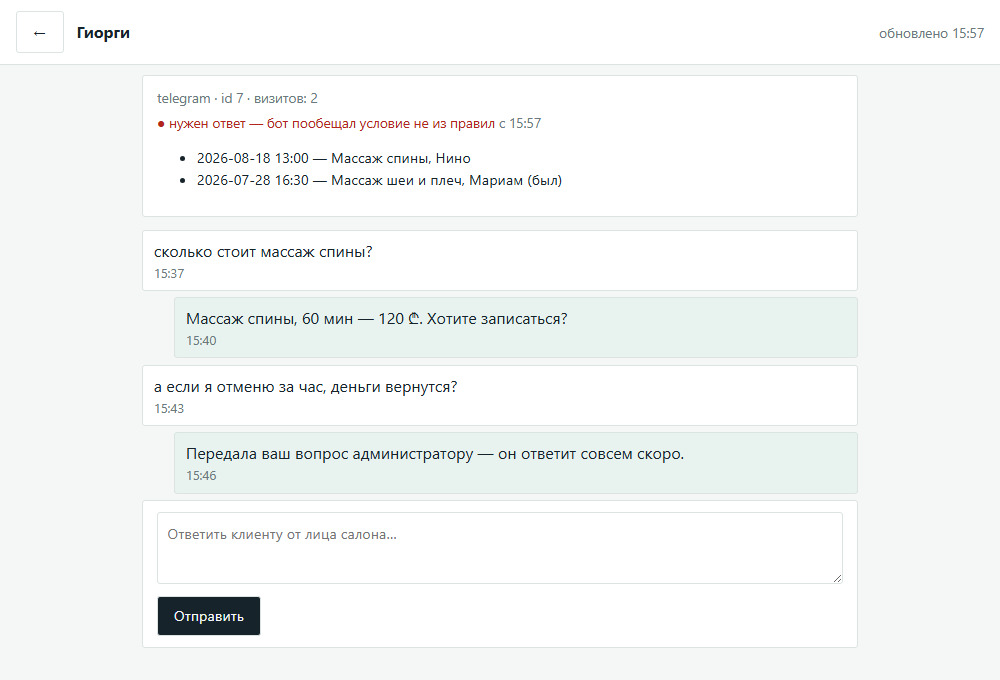
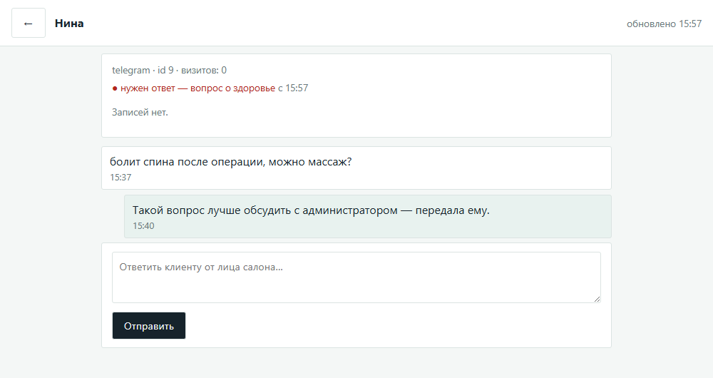
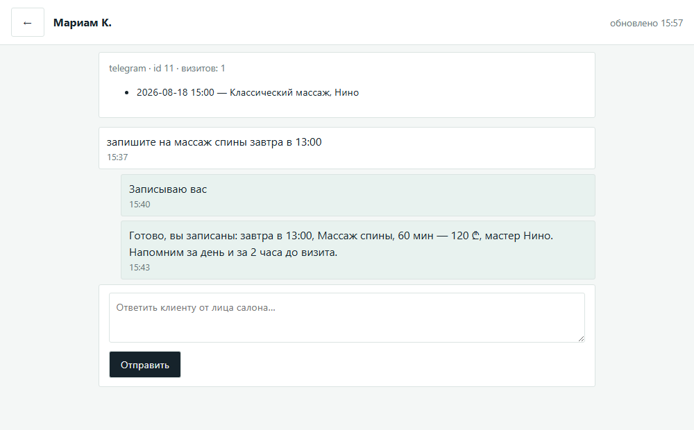
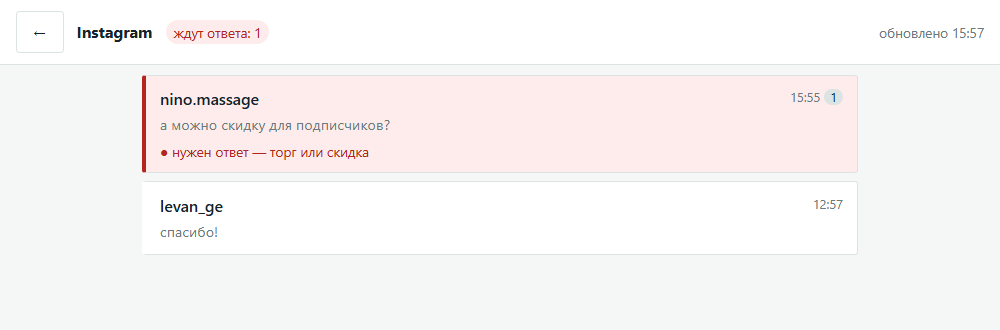
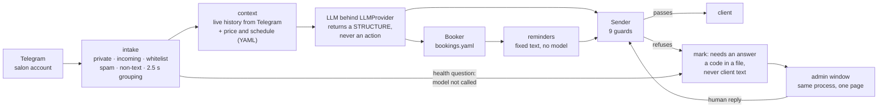

# AICONIC — a Telegram front desk that cannot invent a price

A client writes to a massage salon's Telegram account. One Python process answers in the
salon's voice, books the visit into a real schedule, and reminds the client a day and two
hours before. The moment the conversation touches something the model must not decide alone
— a health question, a discount, a cancellation, any condition that is not in the salon's
rules — it **goes silent in that chat** and raises a flag for a human.

The human answers from a single page that puts every messenger into one feed, marks where
they are actually needed, and shows the client's card next to the conversation.

Built for one salon in Tbilisi, runs live on a real Telegram account. It started as a
commercial proposal; the client walked away, so it is now a personal system for a single
salon — which is why there is no multi-tenancy anywhere in it.

| Measured on 2026-08-17 | |
|---|---|
| `pytest` | **505 tests** in 28 files, all green |
| `tools/mutants.py` | **132 / 132 mutations caught** — every guard proven able to fail |
| product code / test code | 2 958 / **5 609** lines |
| conversation simulator | 28 scenarios, 63 steps, real LLM, faked Telegram |
| answer-quality set | 21 / 21 (`tools/eval_answers.py`, recorded 2026-08-14) |
| invented prices and invented free slots | **zero** in 42 live answers and 27 simulated scenarios (recorded 2026-08-14) |

Reproduce the first two lines with the two commands at the [bottom](#run-it). The Russian
operator manual is [README.ru.md](README.ru.md); the full engineering documentation is in
[docs/](docs/) — it is in Russian, and [why](#why-the-code-is-in-russian) is at the end.

---

## What the human on duty sees



<sup>Four real frames from the window running on the fictional salon data — no Telegram
account and no API key needed to reproduce them: `python tools/демо_окна.py`.</sup>

**One screen for all messengers, before choosing anything: where am I needed?**



The count is deliberately **not** the unread badge. Unread is the messenger's own counter and
stays on chats the bot already closed by itself; "needs help" is our own decision to hand a
conversation to a person. Mixing the two makes the feed useless, so they are two separate
fields all the way through the API.

**The feed: freshest on top, but everyone waiting for a human above everyone else.**



Each waiting row carries the *reason* — not the client's words. The first version of this
sort was wrong in exactly the way that matters: oldest-first, so a message that had just
arrived stayed at the bottom. The first live run reported it as "the site does not load new
messages" — it did load them; they sank. Both orderings are now pinned by a test and by a
mutation.

**The conversation: live from the messenger, plus the client's card.**



The card shows the channel, the visit count, past and upcoming visits, and the handover
reason. It never shows a health detail — only the label "a health question". The
conversation itself is read live from Telegram on every poll and is never copied into our
storage, so there is no second place where a client's medical remark could survive.

The admin's reply leaves through **the same `Sender`** as the model's own answers, with
fewer guards — and that asymmetry is written down where it is decided, not left implicit:
the whitelist still applies, while `STOP`, the rate limit and the "did the model invent
this?" checks do not, because a human wrote the text.

<details>
<summary>Three more frames: a health question handed over, a booking confirmed, and a second channel</summary>





The same window, same page, same card — a different messenger. Nothing here knows it is
Instagram; it is one more implementation of the `Канал` protocol, and the feed does not
care which one it came from:



</details>

---

## The idea the rest of the project hangs on

**A guard blocks. A report only talks.** A protection you can ignore is not a protection —
and the difference is invisible in a code review, because both look like an `if` with a log
line next to it.

So every protection in this system is a guard that actually refuses:

| Guard | What it refuses | Where |
|---|---|---|
| Whitelist | answering anyone who is not on it — by default the bot is **silent**, not helpful | intake **and** `Sender` |
| `STOP` file | the next outgoing message, instantly and reversibly | `Sender` |
| Rate limit | more than 6 answers per chat per minute | `Sender` |
| Health triggers | **calling the model at all** — 56 medical roots, and the request never happens | before the model |
| Spam triggers | answering, and spending a paid token on it — 18 roots | before the model |
| Price check | a price the model produced that is not in the price list | `Sender` |
| Time check | a free slot the model produced that does not exist that day | `Sender` |
| Condition check | refunds, penalties, deposits — any rule the salon never wrote | `Sender` |
| Booking check | a booking overlapping an existing one that day — **whichever master**, so it cannot be bypassed by switching master | `Booker` |

Two structural rules keep the guards unbypassable:

- **The model cannot send and cannot write.** It returns a structure. Only `Sender` sends,
  only `Booker` writes. You cannot add a convenient second path by writing one more call
  somewhere else, because that would need an import that a test forbids.
- **Whatever we send first is not written by a model.** Reminders are the only thing this
  system sends unprompted — for a visit the client confirmed themselves — and their text is
  fixed. There is nobody to check a message that leaves before the client says anything.

The import boundary is itself a guard, and it was a **false one** until a probe caught it:
the test globbed one directory level, so a file in `aiconic/inbox/` could import both
`telethon` and the LLM client and pass all three boundary tests. Found by writing exactly
that file and watching it pass. `glob` → `rglob`, plus three tests that now guard the guard.

---

## Every green test must be able to fail

A green test is worth nothing until you can name the broken implementation it rejects. So
each load-bearing guard has a **mutation**: `tools/mutants.py` patches one line in place,
runs only the test that guards it, demands red, and restores the file in a `finally`.

```
$ python tools/mutants.py
окно без токена не поднимается                     КРАСНОЕ, мутация поймана
ответ администратора идёт только через Sender      КРАСНОЕ, мутация поймана
«нужен ответ» — это метка, а не счётчик непрочитанных КРАСНОЕ, мутация поймана
свежие сообщения в ленте сверху                    КРАСНОЕ, мутация поймана
ждущие человека выше свежих                        КРАСНОЕ, мутация поймана
сбой одного мессенджера не гасит остальные         КРАСНОЕ, мутация поймана
...
поймано: 132 / 132
```

This is not ceremony. It caught a test in this repository being theatre: a test named "no
booking is created at closing time" stayed green with the overlap check removed, because a
*different* guard rejected 21:00 first. The test asserted the outcome, so it passed for the
wrong reason and would have kept passing after the guard it claimed to protect was deleted.
It now asserts the specific intermediate state instead.

Pairing is the other half, and it does **not** replace mutation: for every "a refusal must
reach the client" there is a "on a duplicate it must **not**", for every "the mark survives
a restart" a "free text must never reach the file". Pairing catches an incomplete
requirement; mutation catches a test that stays green when the guard is gone. The theatre
test above had a sensible pair and was still theatre.

Four levels, and each sees something the others cannot:

| Level | Model | Telegram | Finds |
|---|---|---|---|
| `pytest` | faked | faked | logic and guards; blind to how the model behaves |
| `tools/mutants.py` | — | — | whether a guard has teeth |
| `tools/eval_answers.py` | **live** | — | quality of a single answer: 21 questions with known answers |
| `tools/simulate.py` | **live** | faked | **multi-turn conversations through the whole system** |
| by hand in Telegram | live | **live** | what a fake cannot prove |

The simulator exists because every expensive defect of this project was only visible in a
multi-turn dialogue with a live model: the bot fixating on a medical message still sitting in
history, silently swapping the service at confirmation time, four false firings of the time
guard. A test with a faked model inherits the author's belief about what the model will say.

---

## Nothing here was assumed

Each of these cost one probe and saved a wrong build:

| Belief | What the probe showed |
|---|---|
| "we'll log in with an SMS code" | Telegram does not send login codes by SMS to third-party clients at all — *"only the official applications can receive a login/signup code via SMS/call"*. The in-app code goes only to already-live sessions and can silently fail to arrive. **QR login instead.** |
| "the web window needs its own process" | `uvicorn` runs fine as an asyncio task beside Telethon in one process. One process is not just simpler: it means the admin's reply is a method call on the same `Sender`, and there is no queue where a second, guard-free send path could grow. |
| "the URL can be in Russian like the rest of the code" | Cyrillic in a URL path kills the request (`UnicodeEncodeError` encoding the query to ASCII). Starlette finds path-parameter names with `[a-zA-Z_]`, so `{чат_id}` is read as literal path text — `/api/chat/7` returned **404 instead of 401**, making a working access guard look broken. HTTP headers are latin-1, so a Cyrillic token cannot even be sent: the window now refuses to start with a non-ASCII token instead of silently rejecting the right one. |
| "we can estimate the token budget" | Estimates diverged three times over three days: 106K → 196K → 239K, and the live measurement was higher still. Cerebras returns the remaining quota in response headers, so it is **asked, not guessed** — and a pre-flight guard now refuses a run that does not fit. It has already refused one: a 387K-token run against a 376K balance, which would have burned the day's quota and then declared itself inconclusive. |
| "substring triggers are fine" | `боль` matched «больше», `приз` matched «признаться», `займ` matched «займёт» — 8 of 14 harmless phrases fired. 80 tests now pin this: 35 dangerous phrases must fire, 32 harmless must not, 5 guard the greedy roots. |
| "the wiring is covered" | The 382 tests of the time all built the conductor themselves through a fixture, so nobody tested `main.py`. A missing kill-switch wire or a dropped `try` around reading history would have passed every one of them and only shown up in production. The wiring is now its own module function with 9 tests and 5 mutations. |

---

## How it is put together



Deliberately absent, and each absence is a decision with a reason in
[docs/VISION.md](docs/VISION.md): no Docker, no database, no message queue, no npm, no
frontend framework. One process, three YAML files, one HTML page. A channel is a
`Protocol` with four methods, so adding WhatsApp or Instagram is a new implementation, not a
rewrite. You can see that in ten seconds, without a Telegram account or a key:

```bash
.venv\Scripts\python.exe tools/демо_окна.py     # then open http://127.0.0.1:8742
```

That is the real window — real `api.py`, real client card, real handover mark, real `Sender`
— with a fake messenger behind it, and a second channel that is nothing but another
implementation of the same protocol. The screenshots above were taken from it.

Free slots are never stored, only computed: a stored list would have drifted from the
bookings within a day.

Everything in [`data/`](data/) is sample data — an invented price list, three invented
masters, an invented address. No real client, conversation or booking is in this repository,
and the conversation log the system writes at runtime never enters git.

---

## The problem that turned out to be hardest

Not the model. **Time.** A client answers a day later, and everything the system knew is
gone. Three holes, each reproduced by a probe before a single test was written:

1. **Offered times lived in process memory.** The client said "yes, 13:00" the next morning
   and there was nothing to say yes to. Fixed by recovering the offer from our own past
   messages in the Telegram history — the only copy that survives a restart, because it is
   the one the client can see.
2. **History had no dates.** Yesterday's «в 15:00 удобно?» read exactly like today's, and
   the model happily confirmed a slot from the day before. Non-today messages are now
   prefixed with `(12.08)` — in **salon-local time**, because Telegram delivers dates in UTC
   and mixing the two shifts every evening booking by four hours.
3. **The startup catch-up answered everything.** After the process was down, it woke up and
   replied to a backlog including messages that had already been answered by a human. The
   catch-up is now bounded and only fires where the last word is the client's.

A flag set in memory is an intention, not a guarantee. A real guarantee survives a new
process and a hostile caller — which is why the handover mark is a file, and why the reader
for that file was hardened by a deliberately hostile test before the window even existed: a
corrupted mark file used to crash the read with `'str' object has no attribute 'get'`.

---

## Honest limits

- **Local network only.** No HTTPS, the admin token travels in clear text. This must not be
  exposed to the internet as it stands.
- **It runs while `main.py` runs.** No supervisor, no auto-restart — and reminders live and
  die with the process.
- **Files instead of a booking system.** Altegio integration is the next stage; today the
  schedule and the price list are YAML the owner edits by hand.
- **The "a day before" reminder has never been observed live** end to end — that takes 24
  real hours on a real account, and it is marked as unproven in the docs rather than assumed.
- **Georgian is unverified.** The prompt asks for the client's language, and Georgian
  wording is marked as a known weak spot in the simulator, not as a solved case.
- **No AI-processing consent flow yet.** Fine while the only client testing it is the owner;
  mandatory before a real one.
- **One salon.** No tenants, no roles, no admin accounts — one person is on duty.

---

## Run it

```bash
python -m venv .venv
.venv\Scripts\python.exe -m pip install -r requirements.txt
copy .env.example .env
```

```bash
.venv\Scripts\python.exe -m pytest             # 505 tests
.venv\Scripts\python.exe tools/mutants.py      # 132 mutations, all must be caught
```

Neither needs a key, a network, or a Telegram account — the model and the messenger are
faked at that level. The live levels (`tools/eval_answers.py`, `tools/simulate.py`) need a
Cerebras key, and `main.py` needs a Telegram session; both are described in
[README.ru.md](README.ru.md).

⚠️ First run keeps `TG_WHITELIST` empty on purpose. That is observation mode: the process
logs who wrote and **answers nobody**. You take your own id out of the log, put it in the
whitelist, and restart. Silence is the default state of this system, and every step of
setting it up is arranged so that silence is what you get when you have not finished.

---

## Why the code is in Russian

Identifiers, comments and documentation are Russian, because the domain is: the salon, the
client, the guards, the handover, and the model's own system prompt are all in Russian, and
one vocabulary for all of them removes a translation layer from every conversation about the
code. It is a deliberate choice for a system with one author and one owner, not a
recommendation for a team.

The interfaces where the machine demands ASCII are ASCII, and each one has a comment saying
which probe forced it — see the URL paths and the token guard in
[`aiconic/inbox/api.py`](aiconic/inbox/api.py).

Documentation map, in reading order: [STATUS](docs/STATUS.md) (what is proven and what is
not) → [VISION](docs/VISION.md) (why, and the boundaries) →
[ARCHITECTURE](docs/ARCHITECTURE.md) (modules and invariants) →
[HOW-IT-WORKS](docs/HOW-IT-WORKS.md) (behaviour in motion, and library traps) →
[TESTING](docs/TESTING.md) (every number, single source). Stage plans with the rejected
alternatives: [STAGE-1-TELEGRAM](docs/STAGE-1-TELEGRAM.md),
[STAGE-2-INBOX](docs/STAGE-2-INBOX.md).

Those documents refer to one more, `BLUEPRINT.md`, which is **not** part of this repository:
it is the research archive, and it is built around the original commercial proposal — client
terms and revenue projections that stay private. Nothing in the code depends on it.
